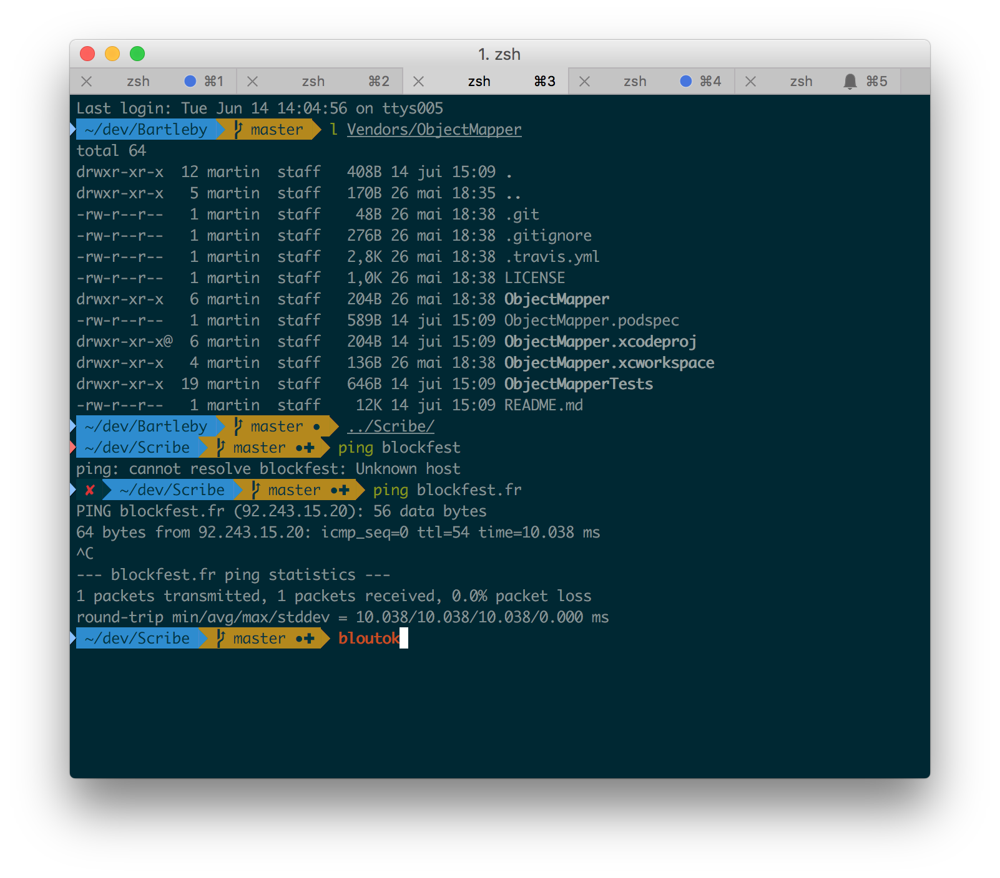

# Dotfiles

[](https://travis-ci.org/MartinDelille/dotfiles)

My custom dotfiles.



## Features

- Bash script:
  - `p` allows pinging until the network is up
  - `freebox` mount the freebox hard drive on `~/freebox`
  - `franceculture` starts the radio with `ffplay`
- Fish:
  - Set custom config, shortcuts and functions
- Git:
  - [.gitconfig](git/.gitignore):
    - Basic config
    - Applescript file versioning
  - [.gitignore](git/.gitignore)
  - [Commit signing](git/README.md#signing-commit)
- Vim:
  - Set custom config and plugin (with <https://github.com/junegunn/vim-plug>)
- MacOS:
  - [Global environment variable](my.env.plist)

## Installation

```
$ git clone --recurse-submodules https://github.com/martindelille/dotfiles ~/.dotfiles
$ ~/.dotfiles/dotsetup
```

## Fish

If you want to use fish you need to add `/usr/local/bin/fish` to `/etc/shells` and run:

```
$ chsh -s $(which fish)
$ exit
```

## Linux

Here are the paquet required to use this *dotfiles*:

```
sudo apt-get install git
```

Here are the step to install the *Powerline* font needed by the *agnoster* theme (taken from [here](https://powerline.readthedocs.org/en/latest/installation/linux.html#fonts-installation):

```
wget https://github.com/powerline/powerline/raw/develop/font/PowerlineSymbols.otf
wget https://github.com/powerline/powerline/raw/develop/font/10-powerline-symbols.conf
mv PowerlineSymbols.otf ~/.fonts/
fc-cache -vf ~/.fonts/
mkdir -p ~/.config/fontconfig/conf.d/
mv 10-powerline-symbols.conf ~/.config/fontconfig/conf.d/
```

